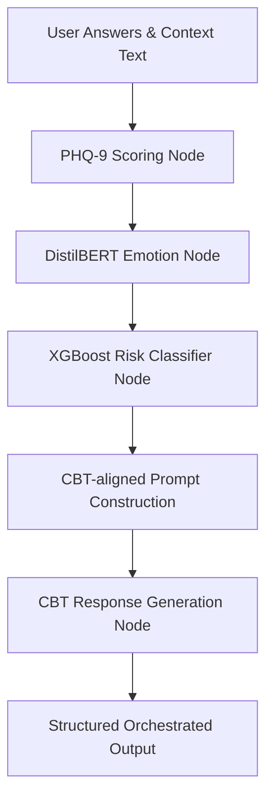

# Healthly - Platform Architecture & System Manual

This manual documents the advanced infrastructure components added to the **Healthly** mental wellness platform, including the LangChain Agentic AI Orchestrator, the Secure WebSocket protocol, the API rate-limiting subsystem, Alembic database migrations, and ML dependency specifications.

---

## 1. Agentic AI Orchestrator

The `AgenticAIOrchestrator` coordinates multimodal indicators through a sequential, state-governed LangChain LCEL (LangChain Expression Language) pipeline to perform clinical risk classification and generate CBT-aligned responses.

### Pipeline Architecture



### Modalities & Sequence Flow
1. **PHQ-9 Scoring Node**: Scores the user's answers (0-27) and maps them to standard clinical severity levels (Minimal, Mild, Moderate, Moderately Severe, Severe).
2. **Emotion Analysis Node (DistilBERT)**: Analyzes any raw text input to classify emotional sentiment (e.g., Sadness, Joy, Anger, Fear) and extracts distress keywords.
3. **Risk Classification Node (XGBoost)**: Takes a combined vector of clinical attributes, physical telemetry (steps, sleep, HRV), and emotional scores to classify mental health risk as `Low`, `Medium`, or `High`.
4. **CBT-aligned Response Node**: Automatically triggers safety escalation if risk is flagged as `High` (bypassing normal classification to prioritize safety), and generates a response aligned with Cognitive Behavioral Therapy (CBT) protocols.

### Code Entrypoint
- File: [agentic_orchestrator.py](file:///d:/Namith/HTML/Healthly/backend/app/services/agentic_orchestrator.py)
- Main Function: `orchestrate_assessment(answers: List[int], text: str = "")`

---

## 2. WebSocket Secure Protocol

The platform implements a real-time, bi-directional WebSocket interface to stream wearable/device telemetry and propagate status alerts to the dashboard.

### WebSockets Endpoint Structure

```
              ┌──────────────────────────────────────┐
              │             FastAPI Backend          │
              └──────────────────┬───────────────────┘
                                 │
         ┌───────────────────────┴───────────────────────┐
         ▼                                               ▼
WS /ws/phone/{device_id}                      WS /ws/dashboard/{device_id}
 (Phone Telemetry Client)                       (Web Dashboard Clients)
```

### A. Phone Protocol (`/ws/phone/{device_id}`)
- **Upgrade Handshake**: Standard WebSocket upgrade request.
- **Registration**: Immediately upon connection, the client MUST send a registration packet:
  ```json
  {
    "type": "register",
    "device_id": "device_id_string",
    "token": "device_plain_pairing_token"
  }
  ```
- **Authentication**: The token is validated against the user's hashed `device_token_hash` in the database. If validation fails, the connection is aborted with close code `4001`.
- **Data Transfer**: Telemetry data is streamed every 5-10 seconds using the format:
  ```json
  {
    "type": "sensor_data",
    "payload": { ...SensorDataPayload... }
  }
  ```
- **Acknowledge (ACK)**: For every telemetry packet, the server replies:
  ```json
  {
    "type": "ack",
    "received_at": "ISO-8601-Timestamp"
  }
  ```

### B. Dashboard Protocol (`/ws/dashboard/{device_id}`)
- **Authentication**: Requires a standard JWT bearer token (passed via the `token` query parameter or subprotocol). If invalid, connection is rejected with close code `1008`.
- **Broadcast Events**: The server pushes updates to all active dashboard monitors when new phone readings arrive:
  ```json
  {
    "type": "update",
    "device_id": "device_id_string",
    "device_status": "online|offline",
    "risk_score": 0.45,
    "latest_reading": { ... }
  }
  ```

---

## 3. Heartbeat & Connection Registry

The server runs an in-memory connection registry tracking active phone links to determine online/offline status.

### Heartbeat Lifecycle
1. **Ping**: Every 30 seconds, the server sends a `{"type": "ping"}` packet to the phone.
2. **Pong**: The phone must respond with a `{"type": "pong"}` packet.
3. **Staleness Threshold**: A background monitoring loop runs every 15 seconds. If `last_pong_time` exceeds **60 seconds**, the connection status is marked `"offline"`.
4. **Dashboard Propagation**: The server automatically broadcasts `{"type": "update", "device_status": "offline"}` to all active dashboard clients.

---

## 4. Telemetry Rate Limiting

To prevent database flooding, the system enforces a strict sliding window rate limit on both REST and WebSocket telemetry ingestion.
- **Constraint**: Maximum **1 message per 3 seconds** per unique `device_id`.
- **REST Behavior**: Returns HTTP `429 Too Many Requests`.
- **WebSocket Behavior**: Returns an error frame `{"type": "error", "message": "Rate limit exceeded"}` and discards the payload.

---

## 5. Database Schema & Migrations (Alembic)

Database schema alterations are managed programmatically via Alembic, targeting the PostgreSQL production system and the local SQLite development database.

### Core Database Additions
- `users.device_token_hash`: Stores the Argon2/PBKDF2 hashed pairing token for secure WebSocket registration.
- `users.device_id`: Matches physical device connections.

### Alembic CLI Workflow

*   **Initialize Alembic** (Already configured):
    ```bash
    alembic init alembic
    ```
*   **Generate an Autogenerated Migration**:
    ```bash
    alembic revision --autogenerate -m "Migration description"
    ```
*   **Apply Migrations to Head (Upgrade)**:
    ```bash
    alembic upgrade head
    ```
*   **Rollback Last Migration (Downgrade)**:
    ```bash
    alembic downgrade -1
    ```

---

## 6. System Requirements & ML Dependencies

The system uses flexible, lower-bounded version constraints to prevent dependency locks while ensuring runtime compatibility under **Python 3.14.0**.

### `requirements.txt` Declarations
```text
# Machine Learning & AI
xgboost>=2.0.0
scikit-learn>=1.4.0
langchain-core>=0.2.10

# Database Migrations
alembic>=1.13.0
```

> [!WARNING]
> NumPy binary compatibility is strict under Python 3.14. Ensure C-extensions compile successfully or leverage pre-compiled wheels during environment setup.
